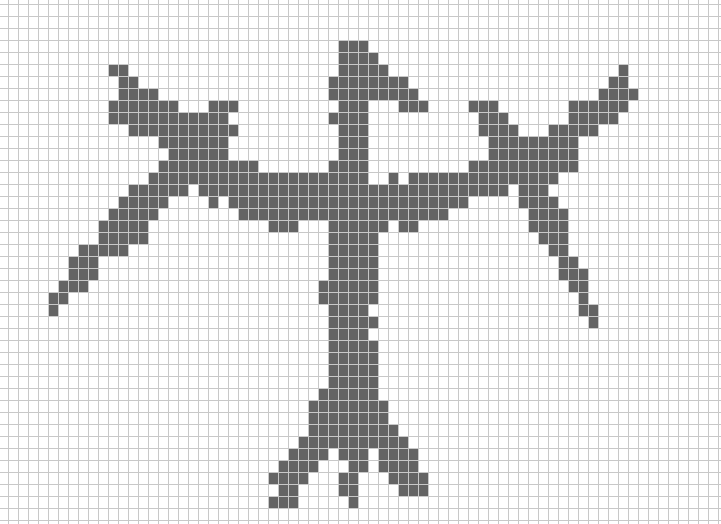

# Урок 7: Редактор препятствий



## 🎯 Цель урока

Создать полнофункциональный редактор карт с препятствиями, который позволяет:
- Рисовать препятствия мышью
- Стирать препятствия
- Отменять действия
- Сохранять и загружать карты

## 📚 Что изучим

### Концепции программирования:
- **Множества (set)** - коллекция уникальных элементов
- **Модульная архитектура** - разбиение кода на файлы
- **Паттерн "История"** - отмена действий
- **Привязка клавиш** - гибкая система команд
- **Работа с JSON** - сохранение/загрузка данных

### Практические навыки:
- Обработка событий мыши (клик, движение, зажатие)
- Обработка клавиатуры
- Отрисовка сетки и графических элементов
- Работа с файлами
- Организация кода в большом проекте

## ⏱️ Структура урока (180 минут)

### ФАЗА 1: Монолит - MVP (70-80 мин)
- **Блок 1:** Введение + Grid (25 мин) → [tasks/task_1_intro_grid.md](tasks/task_1_intro_grid.md)
- **Блок 2:** Рисование и отрисовка (25 мин) → [tasks/task_2_drawing.md](tasks/task_2_drawing.md)
- **Блок 3:** Стирание + подсветка (20 мин) → [tasks/task_3_erasing_hover.md](tasks/task_3_erasing_hover.md)

**✅ Чекпоинт:** Работающий редактор с рисованием и стиранием!

### ФАЗА 2: История отмены (25-30 мин)
- **Блок 4:** Система отмены (25-30 мин) → [tasks/task_4_history_undo.md](tasks/task_4_history_undo.md)

**✅ Чекпоинт:** Редактор с отменой действий!

### ФАЗА 3: Рефакторинг в модули (40-50 мин)
- **Блок 5:** Разбиение на модули (20 мин) → [tasks/task_5_refactoring_modules.md](tasks/task_5_refactoring_modules.md)
- **Блок 6:** InputManager (20-30 мин) → [tasks/task_6_input_manager.md](tasks/task_6_input_manager.md)

**✅ Чекпоинт:** Профессиональная модульная архитектура!

### ФАЗА 4: Сохранение/загрузка (25-30 мин) - БОНУС
- **Блок 7:** MapManager (25-30 мин) → [tasks/task_7_save_load.md](tasks/task_7_save_load.md)

**✅ Финал:** Полностью готовый редактор!

## 📂 Итоговая структура проекта

```
lesson_7_sensors/class/
├── grid.py              # Класс для сетки препятствий
├── history.py           # Класс для истории действий
├── renderer.py          # Класс для отрисовки
├── input_manager.py     # Класс для управления вводом
├── map_manager.py       # Класс для сохранения/загрузки (бонус)
├── main.py             # Главный файл программы
└── map.json            # Сохранённая карта (создаётся программой)
```

## 🎮 Управление готовым редактором

| Клавиша | Действие |
|---------|----------|
| **H** | Показать справку |
| **Z** | Отменить последнее действие |
| **C** | Очистить всё |
| **S** | Сохранить карту |
| **L** | Загрузить карту |
| **ESC** | Выход |
| **ЛКМ (зажать)** | Рисовать препятствия |
| **ПКМ (зажать)** | Стирать препятствия |

## 🎓 Что должны освоить ученики

### Минимум (обязательно на уроке):
- ✅ Блоки 1-3: MVP с рисованием и стиранием
- ✅ Блок 4: Система отмены
- ✅ Блок 5-6: Модульная архитектура

### Бонус (для быстрых или домашка):
- 📝 Блок 7: Сохранение и загрузка

## 🚀 Запуск программы

После завершения всех блоков:

```bash
cd lesson_7_sensors/class
python main.py
```

Или из Jupyter Notebook:

```python
%run main.py
```

## 🌟 Связь с другими уроками

- **Урок 6:** Управление роботом → теперь создаём карты для него!
- **Будущее:** Эти карты можно использовать:
  - Для навигации робота с объездом препятствий
  - Для игры-лабиринта
  - Для стратегической игры
  - Как редактор уровней

## 📊 Временные оценки

| Блок | Время | Кумулятивно |
|------|-------|-------------|
| Блок 1: Grid | 25 мин | 25 мин |
| Блок 2: Рисование | 25 мин | 50 мин |
| Блок 3: Стирание | 20 мин | 70 мин |
| **MVP готов** | | **70 мин** |
| Блок 4: История | 30 мин | 100 мин |
| Блок 5: Модули | 20 мин | 120 мин |
| Блок 6: InputManager | 30 мин | 150 мин |
| **Базовая версия** | | **150 мин** |
| Блок 7: Сохранение (бонус) | 30 мин | 180 мин |

## ✨ Ключевые особенности урока

1. **Быстрый результат** - MVP за 70 минут
2. **Визуальная обратная связь** - сразу видно, что делаешь
3. **Постепенное усложнение** - от монолита к модулям
4. **Практичность** - реальные паттерны программирования
5. **Гибкость** - медленные успеют MVP, быстрые сделают всё

## 🎯 Критерии успеха

**Ученик освоил урок, если:**
- ✅ Понимает, что такое set и зачем он нужен
- ✅ Может обрабатывать события мыши
- ✅ Понимает паттерн "История действий"
- ✅ Умеет разбивать код на модули
- ✅ Может создать систему привязки клавиш
- ✅ Понимает, как сохранять данные в JSON

---

**Удачи на уроке! 🚀**
